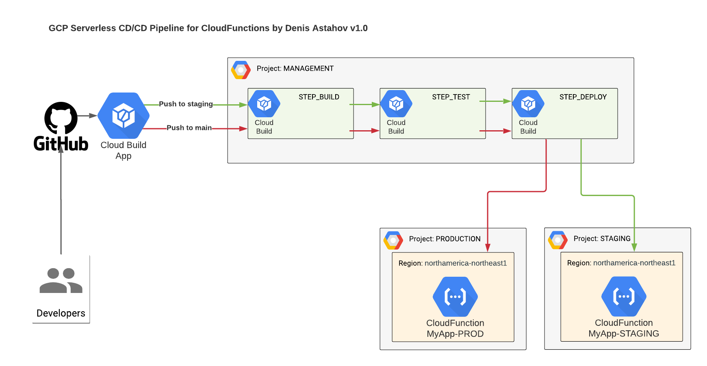

## NodeJS App for GCP Cloud Functions deployed via GCP Cloud Build

In order to deploy via Cloud Build located in project MANAGEMENT to CloudFunction located in project STAGING,PROD you will need:

1. In project MANAGEMENT, get email of account for `xxxxxxxx@cloudbuild.gserviceaccount.com`
2. In project STAGING and PROD add this account as princial into IAM and add Roles:

     | IAM Role Name             | IAM Role Permission             |
     |---------------------------|---------------------------------|
     | Cloud Functions Developer | `roles/cloudfunctions.developer`|
     | Service Account User      | `roles/iam.serviceAccountUser`  |

 

### Copyleft (c) by Denis Astahov